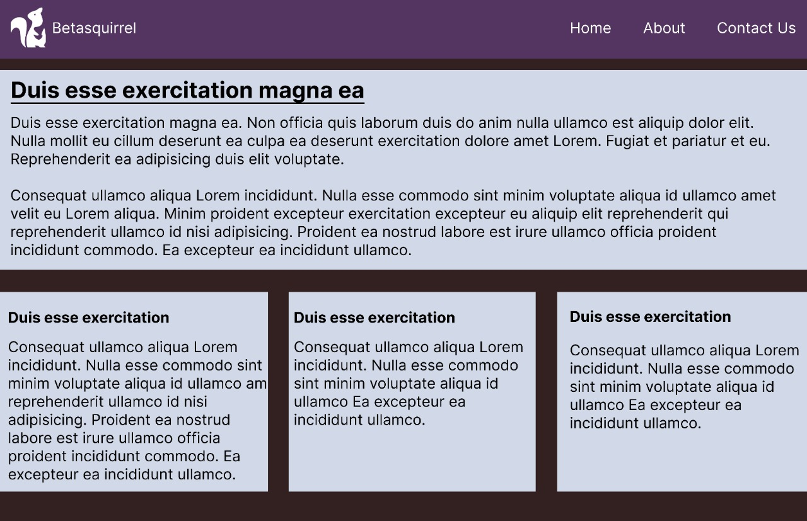
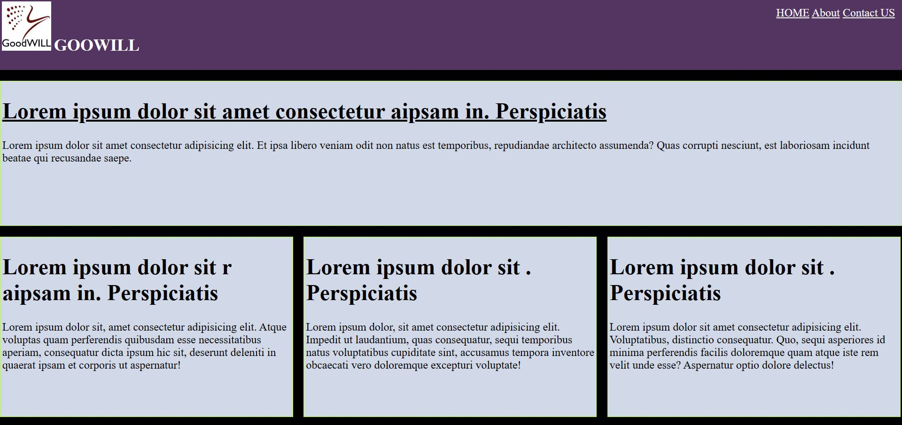
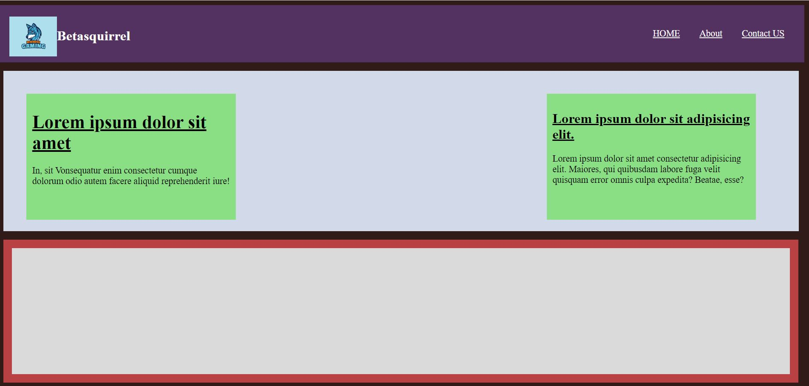
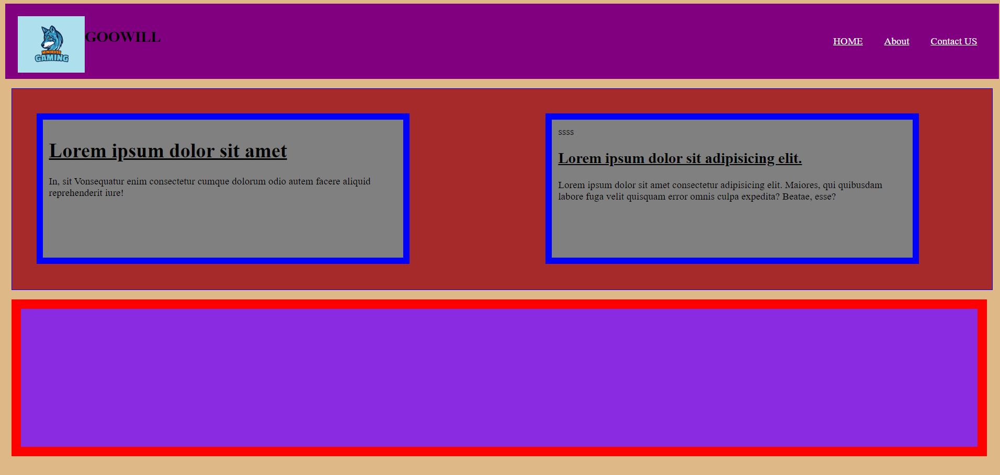

# betasquirrel-tasks

Assignments from betasquirrel

- [Demo](https://aspiya-s.github.io/betasquirrel-tasks/)

## task 6

| Requirements                       | Output                             |
| ---------------------------------- | ---------------------------------- |
|  |   |
|  |   |
|  |  |

## task-3

- [Home](https://www.w3schools.com/html/default.asp)
- [Introduction](https://www.w3schools.com/html/html_intro.asp)
- [Editors](https://www.w3schools.com/html/html_editors.asp)
- [Basic](https://www.w3schools.com/html/html_basic.asp)
- [Elements](https://www.w3schools.com/html/html_elements.asp)
- [Attributes](https://www.w3schools.com/html/html_attributes.asp)
- [Headings](https://www.w3schools.com/html/html_headings.asp)
- [Paragraph](https://www.w3schools.com/html/html_paragraphs.asp)
- [Styles](https://www.w3schools.com/html/html_styles.asp)
- [Formatting](https://www.w3schools.com/html/html_formatting.asp)
- [Quotations](https://www.w3schools.com/html/html_quotation_elements.asp)
- [Comments](https://www.w3schools.com/html/html_comments.asp)
- [Colors](https://www.w3schools.com/html/html_colors.asp)
- [CSS](https://www.w3schools.com/html/html_css.asp)
- [Links](https://www.w3schools.com/html/html_links.asp)
- [Images](w3schools.com/html/html_images.asp)
- [Favicon](https://www.w3schools.com/html/html_favicon.asp)
- [Tables](https://www.w3schools.com/html/html_tables.asp)
- [Lists](https://www.w3schools.com/html/html_lists.asp)
- [Block&Inline](https://www.w3schools.com/html/html_blocks.asp)
- [Classes](https://www.w3schools.com/html/html_classes.asp)
- [Id](https://www.w3schools.com/html/html_id.asp)

## Linus Commands

- `cd`- Change current directory. Ex: `cd Desktop`, `cd..`
- `ls`- List contents of a directory, Ex: `ls -a` lists hidden as well
- `pwd`- Display cureent working path
- `çat` - Display contents of a fil. Ex:`cat README.md`

## GIT comments

1. `git config` configure user Ex. `git config --global user. name "Aspiya-S"`, `git config user. email "aspiyasyed.as@gmail.com"`
2. `git clone` clone a remote git repo to your local. Ex. `git clone https://github.com/Aspiya-S/betasquirrel-tasks`
3. `git add` Add your file changes to git. Ex: `git add .`,`git add README.md`
4. `git commit` Commit changes to git. Ex `git commit -m "Initial commit"`
5. `git push` Push your local commits to remote repo. Ex: `git push origin main`
